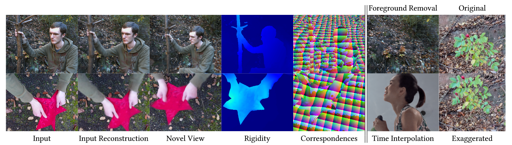
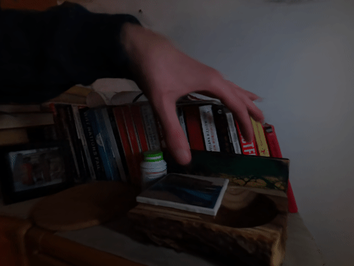
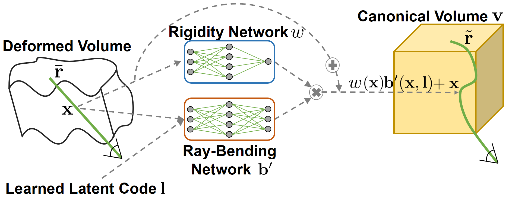

# Non-Rigid Neural Radiance Fields

This is the official repository for the project "Non-Rigid Neural Radiance Fields:
Reconstruction and Novel View Synthesis of a Dynamic Scene From Monocular Video" (NR-NeRF). We extend NeRF, a state-of-the-art method for photorealistic appearance and geometry reconstruction of a static scene, to dynamic/deforming/non-rigid scenes. For details, we refer to [the preprint](https://arxiv.org/abs/2012.12247) and [the project page](https://gvv.mpi-inf.mpg.de/projects/nonrigid_nerf/), which also includes supplemental videos.



## Getting Started

We modified the losses and added multi-view support, some simple scene-editing capabilities, evaluation code, and a naive baseline in a February 2021 update. For the original version of this code, please refer to the `december2020` branch of this repo.

### Installation

* Clone this repository.
* (Optional) Install [Miniconda](https://docs.conda.io/en/latest/miniconda.html).
* Setup the conda environment `nrnerf` (or install the requirements using `pip`):
```
conda env create -f environment.yml
```
* (Optional) For data loading and camera parameter estimation, we have included a dummy implementation that only works on the included example sequence. If you do not want to write your own implementation as specified at the end of this README, you can instead use the following programs and files:
	* Install COLMAP.
	* From [nerf-pytorch](https://github.com/yenchenlin/nerf-pytorch), use `load_llff.py` to replace the example version included in this repo.
		* In `load_llff_data()`, replace `sc = 1. if bd_factor is None else 1./(bds.min() * bd_factor)` with `sc = 1./(bds.max() - bds.min())`
	* From [LLFF](https://github.com/Fyusion/LLFF), copy from `llff/poses/` the three files `colmap_read_model.py`, `colmap_wrapper.py`, and `pose_utils.py` directly into `./llff_preprocessing` (replacing existing files).
		* In `pose_utils.py` fix the imports by:
			* Commenting out `import skimage.transform`,
			* Replacing `from llff.poses.colmap_wrapper import run_colmap` with `from .colmap_wrapper import run_colmap`,
			* Replacing `import llff.poses.colmap_read_model as read_model` with `from . import colmap_read_model as read_model`.
* (Optional) An installation of FFMPEG enables *automatic* video generation from images and frame extraction from video input.
```
conda install -c conda-forge ffmpeg
```

### Walkthrough With an Example Sequence

Having set up the environment, we now show an example that starts with a folder of just images and ends up with a fixed viewpoint re-rendering of the sequence. Please read the sections after this one for details on each step and how to adapt the pipeline to other sequences.

We first navigate into the parent folder (where `train.py` etc. lie) and activate the conda environment:
```
conda activate nrnerf
```
(Preprocess) We then determine the camera parameters:
```
python preprocess.py --input data/example_sequence/
```
(Training) Next, we train the model with the scene-specific config:
```
python train.py --config configs/example_sequence.txt
```
(Free Viewpoint Rendering) Finally, we synthesize a novel camera path:
```
python free_viewpoint_rendering.py --input experiments/experiment_1/ --deformations train --camera_path fixed --fixed_view 10
```
All results will be in the same folder, `experiments/experiment_1/output/train_fixed_10/`.

Overall, the input video (left) is re-rendered into a fixed novel view (right):



## Convenience Features

* Works with video file input,
* Script for lens distortion estimation and undistortion of input files,
* Automatic multi-GPU support (`torch.nn.DataParallel`),
* Automatically continues training if previous training detected,
* Some modifications to lessen GPU memory requirements and to speed-up loading at the start of training.

## Practical Tips for Recording Scenes

As this is a research project, it is not sufficiently robust to work on arbitrary scenes. Here are some tips to consider when recordings new scenes:

* Sequences should have lengths of about 100-300 frames. More frames require longer training.
* Avoid blur (e.g., motion blur or out-of-focus blur).
* Keep camera settings like color temperature and focal length fixed.
* Avoid lens distortions or estimate distortion parameters for undistortion.
* Stick to front-facing camera paths that capture most of the scene in all images.
* Use sufficient lighting and avoid changing it while recording.
* Avoid self-shadowing.
* Only record Lambertian surfaces, avoid view-dependent effects like specularities (view-dependent effects can be activated by setting `use_viewdirs=True`).
* The background needs to be static and dominant enough for SfM to estimate extrinsics.
* Limited scene size: Ensure that the background is not more than an order of magnitude further from the camera compared to the non-rigid foreground.

## Using the Code

### Preprocess

**Determining Camera Parameters**

Before we can train a network on a newly recorded sequence, we need to estimate its camera parameters (extrinsics and intrinsics).

The preprocessing code assumes the folder structure `PARENT_FOLDER/images/IMAGE_NAME1.png`. To determine the camera parameters for such a sequence, please run
```
python preprocess.py --input PARENT_FOLDER
```
The `--output OUTPUT_FOLDER` option allows to set a custom output folder, otherwise `PARENT_FOLDER` is used by default.

**(Optional) Lens Distortion Estimation and Image Undistortion**

While not necessary for decent results with most camera lenses, the preprocessing code allows to estimate lens distortions from a checkerboard/chessboard sequence and to then use the estimated distortion parameters to undistort input sequences recorded with the same camera.

First, record a checkerboard sequence and run the following command to estimate lens distortion parameters from it:
```
python preprocess.py --calibrate_lens_distortion --input PARENT_FOLDER --checkerboard_width WIDTH --checkerboard_height HEIGHT
```
The calibration code uses [OpenCV](https://docs.opencv.org/4.4.0/dc/dbb/tutorial_py_calibration.html). `HEIGHT` and `WIDTH` refer to the number of squares, not to lengths. The optional flags `--visualize_detections` and `--undistort_calibration_images` might help with determining issues with the calibration process, see `preprocess.py` for details.

Then, in order to undistort an input sequence using the computed parameters, simply add `--undistort_with_calibration_file PATH_TO_LENS_DISTORTION_JSON` when preprocessing the sequence using `preprocess.py` as described under *Determining Camera Parameters*.

**(Optional) Video Input**

In addition to image files, the preprocessing code in `preprocess.py` also supports video input. Simply set `--input` to the video file.

This requires an installation of `ffmpeg`. The `--ffmpeg_path PATH_TO_EXECUTABLE` option allows to set a custom path to an `ffmpeg` executable.

The `--fps 10` option can be used to modify the framerate at which images are extracted from the video. The default is 5.

### Training

The config file `default.txt` needs to be modified as follows:
* `rootdir`: An output folder that collects all experiments (i.e. multiple trainings)
* `datadir`: Recorded input sequence. Set to `PARENT_FOLDER` from the `Preprocess` section above
* `expname`: Name of this experiment. Output will be written to `rootdir/expname/`

Other relevant parameters are:
* `offsets_loss_weight`, `divergence_loss_weight`, `rigidity_loss_weight`: Weights for loss terms. Need to be tuned for each scene, see the preprint for details.
* `factor`: Downsamples the input sequence by `factor` before training on it.
* `use_viewdirs`: Set to `True` to activate view-dependent effects. Note that this slows down training by about 20% (approximate) or 35% (exact) on a V100 GPU.
* `approx_nonrigid_viewdirs`: `True` uses a fast finite difference approximation of the view direction, `False` computes the exact direction.

Finally, start the training by running:
```
python train.py
```
A custom config file can optionally be passed via `--config CONFIG_FILE`.

The `train_block_size` and `test_block_size` options allow to split the images into training and test blocks. The scheme is `AAAAABBAAAAABBAAA` for `train_block_size=5` and `test_block_size=2`. Note that optimizing for the latent codes of test images slows down training by about 30% (relative to only using training images) due to an additional backwards pass.

If a previous version of the experiment exists, `train.py` will automatically continue training from it. To prevent that, pass the `--no_reload` flag.

The `--time_conditioned_baseline` flag will turn on the naive NR-NeRF baseline described in the paper.

**(Optional) Multi-View Data and Per-Camera Intrinsics**

NR-NeRF supports multi-view setups. A deformation latent code is associated with each time step, and multiple images can be associated with each time step.

To know which images belong to the same time step, we use `image_to_camera_id_and_timestep.json` in the data `PARENT_FOLDER`.

You can create the JSON file by first filling a `image_to_camera_id_and_timestep` dict in Python:
```
image_to_camera_id_and_timestep[image_filename] = (camera_string, timestep_int)
```
where `image_filename` is one of the filenames in `PARENT_FOLDER/images/`, `camera_string` is an arbitrary string that identifies a camera, and `timestep_int` is an integer that identifies the time step. Then write the dict to a JSON file as follows:
```
import json
with open(PARENT_FOLDER + "image_to_camera_id_and_timestep.json", "w") as json_file:
    json.dump(image_to_camera_id_and_timestep, json_file, indent=4)
```
Example file content with one camera and two time steps:
```
{
    "image00000000.jpg": [
        "0",
        8
    ],
    "image00000001.jpg": [
        "0",
        9
    ]
}
```

To load multi-view data, please replace the call to `load_llff_data` in `train.py` with a call to `load_llff_data_multi_view` in the provided `load_llff.py`. Note that downsampling images by a factor is not implemented in `load_llff_data_multi_view`.

Furthermore, using multi-view data requires specifying per-camera intrinsics. In the implementation, the file `PARENT_FOLDER/calibration.json` contains both intrinsics and extrinsics. Note that this `calibration.json` file is not necessary for monocular setups. If you want to use per-image intrinsics for a monocular setup, treat it as a multi-view setup where each image has its own unique time step.

Similar to before, `calibration.json` starts out as a Python dict `calibration`. It contains entries `calibration["min_bound"] = min_bound` and `calibration["max_bound"] = max_bound` that each are a float. `min_bound` is the distance from a camera to the near plance, and `max_bound` is the distance to the far plane, both in world units. In addition, for each camera, `calibration` contains an entry `calibration[camera_string] = camera_calibration`, where `camera_string` has to be consistent with the `camera_string` from `image_to_camera_id_and_timestep`. `camera_calibration` is again a Python dict that contains an entry `translation` (list of three floats), `rotation` (list of three lists of three floats, gotten via `rotation.tolist()` from a numpy array), `center_x` and `center_y` (each a float, camera center in pixel units), `focal_x` and `focal_y` (each a float, focal length in pixel units), and `height` and `width` (each an integer, in pixel units). For translation and rotation, see at the end of this README for how they are defined.

Example file content with one camera named `0`:
```
{
    "min_bound": 0.0,
    "max_bound": 2.0189487179595886,
    "0": {
        "translation": [
            -0.041070333333333334,
            1.1753333333333333,
            0.49935666666666667
        ],
        "rotation": [
            [
                0.0577962,
                -0.997661,
                -0.0364925
            ],
            [
                0.558001,
                0.00197212,
                0.829838
            ],
            [
                -0.827825,
                -0.0683243,
                0.55681
            ]
        ],
        "center_x": 2572.48,
        "center_y": 1875.78,
        "focal_x": 5363.46,
        "focal_y": 5363.46,
        "height": 3840,
        "width": 5120
    }
}
```


### Free Viewpoint Rendering

Once we've trained a network, we can render it into novel views.

The following arguments are mandatory:
* `input`: Set to the folder of the trained network, i.e. `rootdir/expname/`
* `deformations`: Set to the subset of the deformations/images that are to be used. Can be `train`, `test`, or `all`
* `camera_path`: Possible camera paths are: `input_recontruction`, `fixed`, and `spiral`.

Then, we can synthesize novel views by running:
```
python free_viewpoint_rendering.py --input INPUT --deformations train --camera_path fixed
```

The `fixed` camera view uses the first input view by default. This can be set to another index (e.g. 5) with `--fixed_view 5`.

**Evaluation**

When using `fixed`, the code will compute the standard deviation across images to visualize the background stability and store the result in `standard_deviation.png`.

When using `input_recontruction`, the code will automatically evaluate the resulting renderings quantitatively against the groundtruth and store the result in `scores.json`. In order to optionally use [LPIPS](https://github.com/richzhang/PerceptualSimilarity) during evaluation, you can clone the required code (in the main folder):
```
git clone https://github.com/richzhang/PerceptualSimilarity
```

**Simple Scene Editing**

The `--motion_factor 1.2` option exaggerates the deformation by a factor of 1.2. Factors below 1 dampen the motion.

The `--foreground_removal 0.01` option removes points that are more non-rigid than the provided threshold.

Furthermore, the forced background stabilization described in the preprint can be used by passing a threshold via the `--forced_background_stabilization 0.01` option.

`free_viewpoint_rendering.py` contains code for time interpolation that can be easily adapted to a specific scenario. Search for `example with time interpolation from a fixed camera view` in the file.

The canonical model (without any ray bending applied) can be rendered by setting the `--render_canonical` flag.

**(Optional) Video Generation**

For automatic video generation, please install `ffmpeg`. The framerate of the generated output videos can be set with `--output_video_fps 5`.

**(Optional) Adaptive Spiral Camera Path**

It is possible to use a spiral camera path that adapts to the length of the video. If you do not want to implement such a path yourself, you can copy and modify the `else` branch in `load_llff_data` of [LLFF's](https://github.com/Fyusion/LLFF) `load_llff.py`. You can find a recommended wrapper in `free_viewpoint_rendering`: `_spiral_poses`. Set `N_views` to `num_poses`. We recommend multiplying `rads` in `render_path_spiral` right before the `for` loop by `0.5`.


## Cite

When using this code, please cite our preprint ``Tretschk et al.: Non-Rigid Neural Radiance Fields`` as well as the following works on which it builds:
```
@misc{tretschk2020nonrigid,
      title={Non-Rigid Neural Radiance Fields: Reconstruction and Novel View Synthesis of a Dynamic Scene From Monocular Video},
      author={Edgar Tretschk and Ayush Tewari and Vladislav Golyanik and Michael Zollhöfer and Christoph Lassner and Christian Theobalt},
      year={2020},
      eprint={2012.12247},
      archivePrefix={arXiv},
      primaryClass={cs.CV}
}
@misc{lin2020nerfpytorch,
  title={NeRF-pytorch},
  author={Yen-Chen, Lin},
  howpublished={\url{https://github.com/yenchenlin/nerf-pytorch/}},
  year={2020}
}
@inproceedings{mildenhall2020nerf,
 title={NeRF: Representing Scenes as Neural Radiance Fields for View Synthesis},
 author={Ben Mildenhall and Pratul P. Srinivasan and Matthew Tancik and Jonathan T. Barron and Ravi Ramamoorthi and Ren Ng},
 year={2020},
 booktitle={ECCV},
}
```

## Specification of Missing Functions

`load_llff_data` from `load_llff.py` needs to return a numpy array `images` of shape `N x H x W x 3` with RGB values scaled to lie between 0 and 1, a numpy array `poses` of shape `N x 3 x 5`, where `poses[:,:,:3]` are the camera extrinsic rotations, `poses[:,:,3]` are the camera extrinsic translations in world units, and `poses[:,:,4]` are `height, width, focal length` in pixels at every frame (the same at all `N` frames), `bds` is a numpy array containing the depth values of near and far planes in world units (only the maximum and minimum entries of `bds` matter), `render_poses` is a numpy array of shape `N x 3 x 4` with rotation and translation encoded as for `poses`, and `i_test` is an image index. The first argument specifies the directory from which the images should be loaded, and the second argument specifies a downsampling factor that should be applied to the images. The remaining arguments can be ignored.

`gen_poses` from `llff_preprocessing/pose_utils.py` should compute and store camera parameters of the images given by the first argument such that the format is compatible with `load_llff_data`. The second argument can be ignored.

The camera extrinsic translation is in world space. The translations should be scaled such that the overall scene roughly lies in the unit cube. The camera extrinsic rotation is camera-to-world, `R * c = w`. The camera coordinate system has the x-axis pointing to the right, y up, and z back.

## License

This code builds on the [PyTorch port by Yen-Chen Lin](https://github.com/yenchenlin/nerf-pytorch) of the [original NeRF code](https://github.com/bmild/nerf). Both are released under an MIT license. Several functions in `run_nerf_helpers.py` are modified versions from the [FFJORD code](https://github.com/rtqichen/ffjord), which is released under an MIT license. We thank all of them for releasing their code.

We release this code under an MIT license as well. You can find all licenses in the file `LICENSE`.


